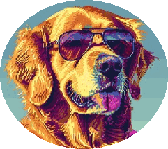

<h1 align="center">Hi, I'm Brent</h1>

<a href="https://brentter.com">Everything's Better With Brentter</a>

  

Welcome to my little corner of this git universe. I hope you find whatever it was you were looking for. Either way I'm just happy you stopped by.

  
|   | [Reddit: brentter](https://reddit.com/u/brentter) |  | [Twitter/X: Brentter](https://x.com/brentter) |
|----|----|----|----|
|  | [Steam: Brentter](https://steamcommunity.com/id/brentter) |  | [Spotify: Brentter](http://open.spotify.com/user/brentter) |
|  | [Ko-fi: Brentter](https://ko-fi.com/brentter) |  | [Mastodon: defcon.social@brentdev](https://defcon.social/@brentdev) |
|   | [Blog: Brentter.com](https://brentter.com) |   | [RSS Feed](https://brentter.com/index.xml) |

        
  

